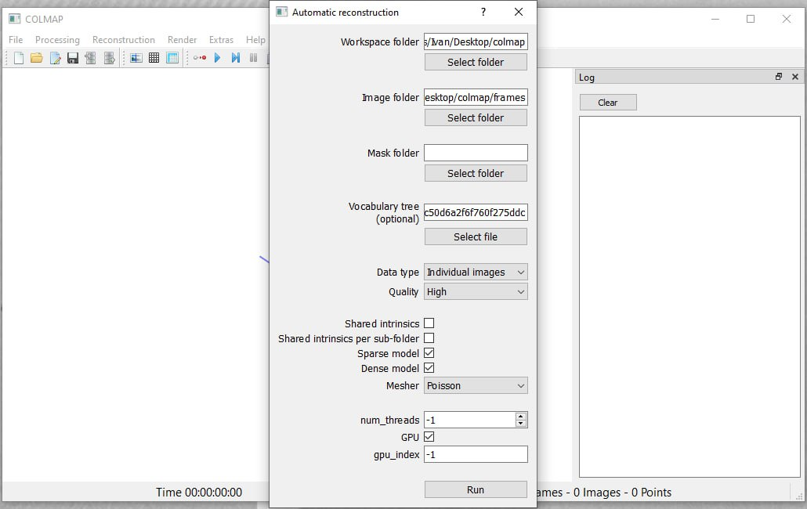
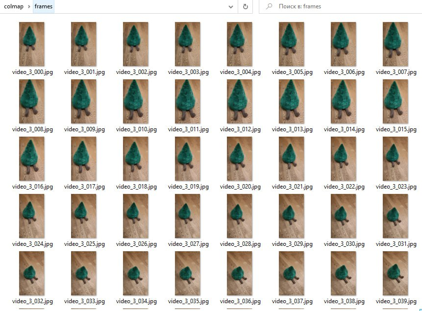
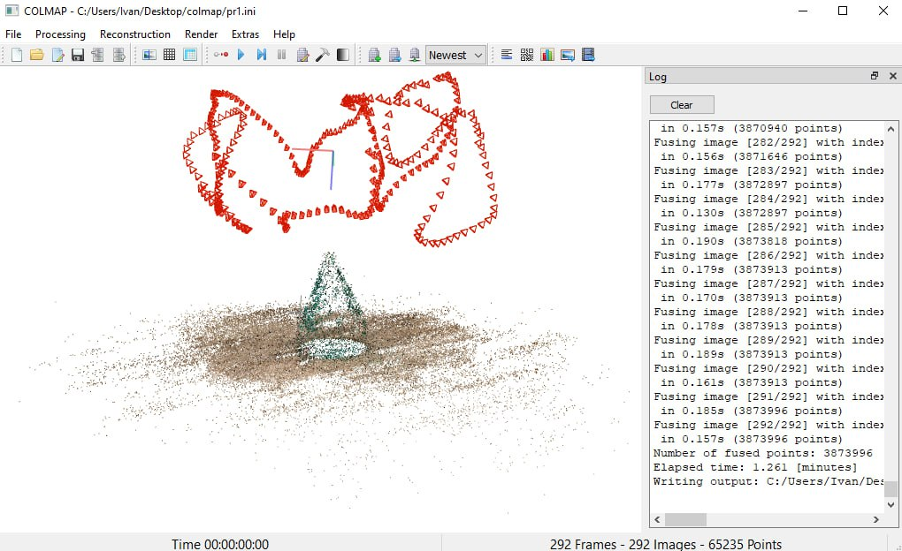
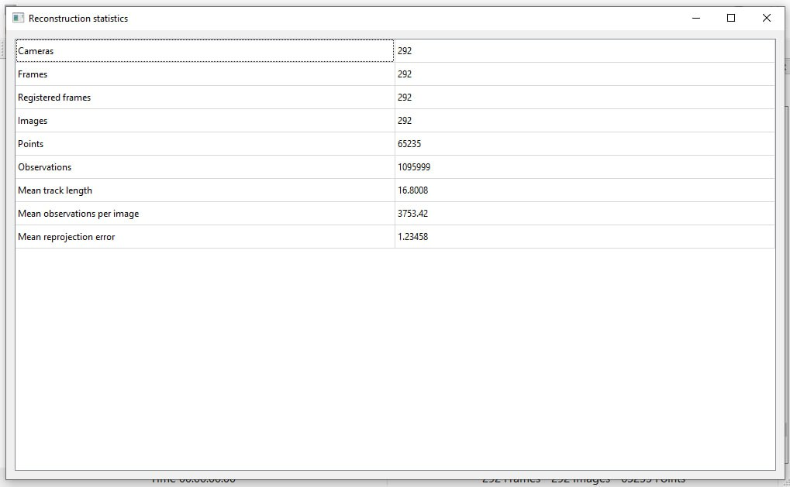
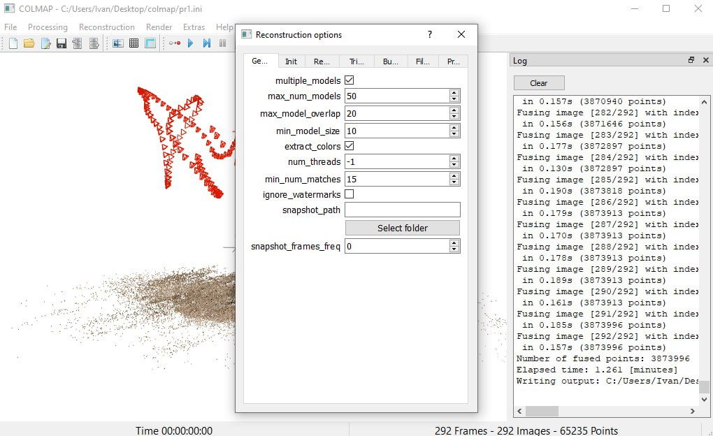
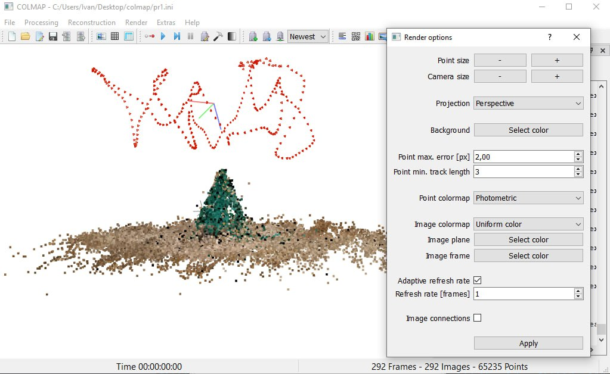

# Практика 1: Съёмка объекта, работа в COLMAP

Для начала моделирования можно воспользоваться автоматической реконструкцией. Задается рабочая папка и папка с изображениями.

Пример папки с изображениями объекта, снятого с разных ракурсов. Используется около 300 фотографий елочки.

После обработки изображений получается интерактивная 3D модель из ключевых точек и положения камеры (красные пирамидки). В данном примере большая часть точек оказалась на полу, а не на снимаемом объекте.

В меню сверху можно посмотреть статистики реконструкции или задать ее параметры.

Можно менять настройки рендеринга, например увеличить размер точек или уменьшить размер камеры.

