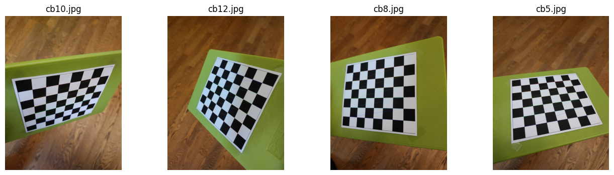

# Практика 2: Калибровка камеры, постороение эпиполярных линий

- Импорт данных: 14 изображений шахматки (число внутренних углов - 7x6), 2 изображения сцены

  Пример изображения шахматки:

  

  Изображение сцены:

  

- Детекция углов шахматки: найдено 14/14 изображений с углами

  Примеры результатов детекции:

  

- Калибровка камеры

  Изображения до и после коррекции искажения:

  

  Видно, что искажения происходят на углах изображения

- Построение эпиполярных линий

  Результат построения:

  

  Эпиполярные полюса находятся за пределами изображений. Это означает, что камеры смотрят примерно в одном направлении, положение одной камеры не видно на другой. 